<p align="center">
  
</p>

<h1 align="center">Shadow</h1>
<p align="center"><em>Your computer was paying attention the whole time.</em></p>

<p align="center">
  <a href="LICENSE"></a>
  
  
  
  
</p>

---

Shadow is a personal intelligence engine for macOS. It captures every signal your computer produces while you work, turns raw behavior into structured understanding, and acts on what it learns. Screen, audio, keystrokes, the full accessibility tree, clipboard, files, git, terminal, search queries, notifications, calendar, system context. All of it, synchronized by timestamp, stored locally, processed on-device. Crash-proof recording that loses at most ten seconds on a force quit. Automatic sleep/wake recovery with display hot-plug detection. Under 3% CPU average. Under 600 MB per day.

This is not a screen recorder. Shadow generates episodes from your work, runs a continuous heartbeat that pushes proactive observations, operates vision models and LLMs entirely on Apple Silicon, fine-tunes its own grounding models on your behavior, replays learned procedures through a safety-gated computer-use engine, and exposes a 26-tool agent runtime with streaming UI. It captures how you work, learns why, and starts helping before you ask.

We are open-sourcing Shadow because the capture layer is the hardest problem to solve and we have solved it. The next layer, memory graphs, MCP servers, personal models, agents trained on real human behavior, belongs to the community. Build on top of what is here.

## Shadow in Action

<p align="center">
  
</p>

<details>
<summary><strong>Onboarding</strong></summary>
<p>Four-step setup: welcome, permissions, model download, launch. Shadow walks you through granting Screen Recording, Accessibility, Input Monitoring, Microphone, and Speech Recognition. Models download on-device during setup.</p>
<!--  -->
</details>

<details>
<summary><strong>Proactive Inbox and Heartbeat</strong></summary>
<p>Shadow's heartbeat runs two-tier analysis (fast every 10 minutes, deep every 30) and pushes observations to an overlay and inbox. "Your commit is still pending." "150 context switches in 2 hours." "Meeting follow-up needed." Real suggestions, not canned templates.</p>
<!--  -->
</details>

<details>
<summary><strong>Search</strong></summary>
<p>Spotlight-quality overlay (Option+Space). Hybrid search across CLIP visual embeddings, Tantivy full-text, and timeline. "When was I looking at that chart?" returns results by meaning, not just text matching.</p>
<!--  -->
</details>

<details>
<summary><strong>Timeline</strong></summary>
<p>Multi-track scrubber like a DAW. Screenshot track, app track, audio waveform, input density. Drag the playhead to any moment in your day.</p>
<!--  -->
</details>

<details>
<summary><strong>Live Stats</strong></summary>
<p>343,000+ events captured across 39 apps. 473 episodes synthesized. 3,386 CLIP embeddings generated. All processed locally, all while the Mac runs normally. Close the lid, open it back up, Shadow picks up exactly where it left off.</p>
<!--  -->
</details>

## How Shadow Compares

Every existing tool looks at one or two modalities. Shadow captures fourteen.

| | Shadow | Screenpipe | Microsoft Recall | Mem0 | Anthropic Computer Use |
|---|---|---|---|---|---|
| Modalities | 14 | 3-4 | 1 (screenshots) | 0 (text from chat) | 1 (screenshots, on-demand) |
| Accessibility tree | Full snapshots | Partial | No | No | No |
| Episode generation | Yes | No | No | No | No |
| Proactive intelligence | Heartbeat with push suggestions | No | No | No | No |
| On-device LLM | Qwen 7B/32B via MLX | No | No | No | Cloud API |
| Vision grounding | ShowUI-2B + LoRA fine-tuning | No | No | No | Screenshot-only |
| Computer-use agent | 26-tool agent + Mimicry system | No | No | No | Yes (cloud) |
| Safety gates | Pre-action checks + undo manager | No | No | No | No |
| Meeting intelligence | Whisper + summaries + speaker attribution | No | No | No | No |
| Learned procedures | Workflow replay from observation | No | No | No | No |
| Open source | MIT | MIT | No | Apache 2.0 | No |
| Price | Free | $400 lifetime | Free (requires $1000+ PC) | $19+/mo | Per token |

Each modality multiplies every other. A screenshot tells you what was on screen. Add keystrokes and you know what the user typed. Add the accessibility tree and you know what every element is and what was clicked. Add clipboard and you know what they deemed important. Add git and you know what they produced. Add terminal and you know what succeeded and failed. Add search queries and you know their intent. This is not additive, it is combinatorial.

## What Shadow Does

Shadow records your Mac like a studio records a band. Each signal gets its own track. Time is the universal key.

**Capture.** Continuous screen recording across all displays using fragmented MP4 (H.265 hardware-encoded). Multi-display hot-plug: connect or disconnect a monitor mid-session and Shadow adapts. Microphone and system audio with on-device Whisper transcription and word-level timestamps. Audio is mic-triggered: Shadow does not record silence, it starts when your mic goes active and waits 30 seconds after it goes quiet. Every keystroke, click, scroll, and gesture, with every mouse click enriched by the accessibility element at those coordinates (role, title, identifier) at sub-millisecond latency. Passwords never reach the event pipeline: secure text fields are detected at the CGEventTap level before anything is written to storage. Full accessibility tree snapshots of every focused app, diff-aware, capturing the semantic structure of every UI element. Clipboard with source and destination app. File changes, git commits, terminal commands with exit codes, search queries, notifications, calendar events, and system context. 200-600 MB per day. A 512 GB Mac stores 6-12 months.

**Understand.** Episode generation detects activity boundaries and produces structured work units with LLM summaries. A proactive heartbeat runs two-tier analysis and pushes suggestions without being asked. Semantic search combines CLIP vector embeddings (search by meaning), Tantivy full-text search, and timeline queries. Meeting intelligence transcribes, summarizes, and attributes speakers. Pattern detection over weeks reflects how you actually work: when your focus happens, how you communicate, what you consistently underestimate. A two-tier local LLM system (7B for fast tasks, 32B for deep reasoning) runs entirely on Apple Silicon with KV-cache session reuse that drops first-token latency from 14 seconds to under 1 second across multi-turn conversations.

**Act.** A 26-tool agent runtime with streaming UI handles search, context retrieval, visual analysis, AX-based actions, and memory operations. The Mimicry system watches how you perform tasks, synthesizes replayable procedures, and executes them through a safety-gated pipeline with pre-action checks, post-action verification, and undo support. A grounding oracle cascades through four strategies: AX exact match, AX fuzzy match, on-device VLM (ShowUI-2B), and cloud vision. 70-80% of interactions are resolved by the free, instant AX path. Built-in LoRA training generates grounding data from your actual clicks and fine-tunes the vision model to your specific apps and workflows. When the agent takes actions, those events are tagged and excluded from recording. Shadow learns from you, not from itself.

**Remember.** A semantic memory store holds knowledge entries by category: preferences, facts, patterns, relationships, skills. Directive memory stores your instructions. Behavioral search finds past workflows similar to what you are doing now. Procedure matching surfaces learned workflows when context suggests they are relevant. Three-tier retention manages storage automatically: hot (7 days, full video and audio), warm (8-30 days, keyframes and transcripts), cold (31+ days, indices only). Transcripts are never deleted until their source audio has been fully transcribed. Storage stays under a configurable cap.

## Why This Matters for Computer-Use AI

LLMs can write code that takes staff engineers days. They still cannot use a computer like an eight-year-old. They cannot click buttons reliably, navigate between apps, handle unexpected popups, or recover from errors. A recent study found the best agent completes only 24% of real office tasks. Another showed that just 312 real human trajectories can outperform Claude 3.7 Sonnet at computer use.

The problem is training data. Synthetic benchmarks use scripted tasks in sandboxes. The messy, multi-app reality of how people actually work does not exist in any dataset. Shadow produces it. Every user action is preceded by a screen state (screenshot + accessibility tree) and followed by a new screen state. That is the exact `(state, action, next_state)` format needed for behavioral cloning. One user generates 25,000-40,000 actions per day. Undo detection provides negative examples. Episode boundaries provide goal annotations. This data cannot be synthetically generated.

Co-pilots need API integrations. Shadow does not. Slack is already on your screen. Shadow sees what is there, who sent what, and what you did about it.

## The Vision

Shadow starts as search. "What was I doing at 2pm?" returns the screenshot, the transcript, the context.

Over days, it becomes a behavioral mirror. It reflects how you actually work, not how you think you work. Pattern detection, time allocation, commitment tracking.

Over weeks, it becomes an apprentice that earns trust gradually:

1. **Tell me things I forgot.** Search, playback, summaries.
2. **Remind me about things coming up.** Meeting prep, commitment tracking.
3. **Prepare things I'll need.** Assemble context, surface relevant history.
4. **Do things for me.** Learned procedure replay through the safety-gated Mimicry system. For full computer use, [Ghost OS](https://github.com/ghostwright/ghost-os) provides the action layer.

The endgame: all of this data flowing to your own infrastructure, your own models. A living understanding of how you work that any AI can query with your permission. Memory graphs connecting episodes, people, projects, and commitments. An MCP server that lets any AI agent access your context. Personal models trained on the richest behavioral dataset that exists: yours.

## Architecture

```
Shadow (macOS menu bar app, Swift + Rust)
|
|-- Capture (Swift, Apple-native APIs)
|   |-- ScreenCaptureKit    per-display H.265, fragmented MP4, sleep/wake recovery
|   |-- CGEventTap          keystrokes, mouse, scroll, AX enrichment, undo detection
|   |-- AXUIElement         accessibility tree, browser URLs, window titles
|   |-- AVFoundation        mic-triggered audio, system audio via SCK
|   |-- FSEvents            file system + git directory monitoring
|   +-- NSWorkspace         app switches, sleep/wake, display hot-plug
|
|-- Storage (Rust via UniFFI)
|   |-- MessagePack event log (zstd compressed, hourly rotation)
|   |-- Tantivy full-text search
|   |-- CLIP vector embeddings (cosine similarity)
|   |-- SQLite timeline index (WAL mode)
|   +-- 3-tier retention (hot / warm / cold, configurable cap)
|
|-- Intelligence (Swift + on-device models)
|   |-- MobileCLIP-S2       image embeddings (CoreML, Neural Engine)
|   |-- Whisper             transcription (MLX, Apple Silicon)
|   |-- Qwen 7B/32B         reasoning + summaries (MLX, KV-cache reuse)
|   |-- Qwen2.5-VL-7B       vision understanding (MLX)
|   |-- ShowUI-2B           UI grounding + LoRA fine-tuning on your usage
|   |-- nomic-embed         text embeddings
|   |-- Episode engine      boundary detection + summarization
|   |-- Proactive heartbeat fast 10min / deep 30min, push suggestions
|   |-- Agent runtime       26 tools, streaming UI, task decomposition
|   +-- Mimicry             procedure learning, safety gates, undo support
|
+-- UI (SwiftUI, native macOS)
    |-- Menu bar            status, mini timeline, pause/resume
    |-- Search overlay      Spotlight-quality, CLIP + text hybrid
    |-- Timeline            multi-track scrubber (video + app + audio)
    |-- Proactive overlay   suggestions, inbox, trust feedback
    +-- Settings            API keys, models, retention, preferences
```

## Build From Source

```bash
git clone https://github.com/ghostwright/shadow.git
cd shadow

# Build Rust storage engine and generate Swift bindings
./scripts/build-rust.sh

# Install Python dependencies and download CLIP models (~190 MB)
pip3 install huggingface_hub open_clip_torch
python3 scripts/provision-clip-models.py

# Generate Xcode project and build
cd Shadow && xcodegen generate && cd ..
xcodebuild -project Shadow/Shadow.xcodeproj -scheme Shadow -configuration Debug build

# Launch
open ~/Library/Developer/Xcode/DerivedData/Shadow-*/Build/Products/Debug/Shadow.app
```

Requires Apple Silicon (M1 or later), macOS 14+, Xcode 16.4+, Rust via rustup, Python 3.8+, XcodeGen (`brew install xcodegen`). The Qwen 32B model requires 48 GB+ RAM. Grant permissions when prompted. After granting Screen Recording, quit and relaunch.

## Privacy

Your data stays on your machine. Shadow does not phone home. There is no account, no telemetry, no cloud dependency.

Passwords and sensitive fields are detected at the CGEventTap level and excluded before reaching storage. You can pause recording, exclude apps, or delete any time range of data.

Cloud LLM features (Claude, GPT) are opt-in with your own API key. When disabled, all intelligence runs locally via MLX on Apple Silicon.

This is open source. You do not need to trust a privacy policy. Read the code. See [PRIVACY.md](PRIVACY.md) for the full data handling details.

## Contributing

We need testing across hardware (M1 through M4), smarter episode detection, memory graph construction, MCP server development, new capture tracks (browser extensions, IDE plugins), better proactive analysis models, and documentation. If you are building agents that operate computers, Shadow is the observation layer.

See [CONTRIBUTING.md](CONTRIBUTING.md) for setup and guidelines.

## Acknowledgments

Shadow exists because Apple Silicon made on-device intelligence practical. The M-series chips, Neural Engine, VideoToolbox hardware encoding, ScreenCaptureKit, and CoreML together make it possible to capture, transcribe, embed, and reason about your entire computer usage without touching the cloud. We believe Apple Silicon is the future of personal AI and Shadow is built entirely around that conviction.

- **Apple** for [MLX](https://github.com/ml-explore/mlx-swift) (on-device ML inference that makes local LLMs and vision models viable), [MobileCLIP](https://github.com/apple/ml-mobileclip) (efficient CLIP for semantic search on the Neural Engine), ScreenCaptureKit, VideoToolbox, and CoreML
- **[Argmax](https://github.com/argmaxinc/WhisperKit)** for WhisperKit, bringing Whisper transcription to Apple Silicon natively
- **[Quickwit](https://github.com/quickwit-oss/tantivy)** for Tantivy, the full-text search engine in Rust that powers Shadow's instant search across hundreds of thousands of events
- **[Mozilla](https://github.com/mozilla/uniffi-rs)** for UniFFI, making our Swift-Rust bridge seamless
- **[Hugging Face](https://github.com/huggingface/swift-transformers)** for swift-transformers, providing the Hub client and tokenizer infrastructure
- **[Ghost OS](https://github.com/ghostwright/ghost-os)** (900+ stars), our open-source computer-use engine that provides the action layer where Shadow provides the observation layer

## License

MIT
